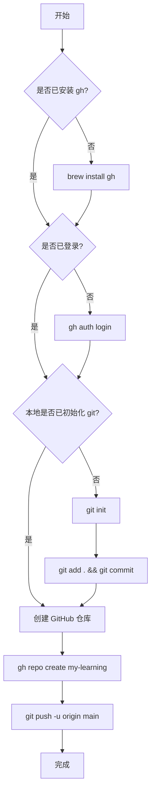

# GitHub 仓库创建计划

## 任务目标
在 GitHub 上创建 `my-learning` 仓库，并将本地目录内容推送上去。

## 前置条件检查
- [x] 已有 GitHub 账号
- [ ] 已安装 GitHub CLI
- [ ] 已完成 GitHub CLI 登录认证

---

## 步骤详情

### 步骤 1: 安装 GitHub CLI

在 macOS 上使用 Homebrew 安装：

```bash
brew install gh
```

验证安装：
```bash
gh --version
```

### 步骤 2: 登录 GitHub CLI

运行登录命令：
```bash
gh auth login
```

按提示选择：
1. `GitHub.com` （选择 GitHub 云服务）
2. `HTTPS` （选择 HTTPS 协议）
3. `Login with a web browser` （通过浏览器登录）

然后在浏览器中完成授权。

验证登录状态：
```bash
gh auth status
```

### 步骤 3: 创建 GitHub 仓库

在当前目录下执行：

```bash
gh repo create my-learning --public --source=. --remote=origin --push
```

参数说明：
- `--public`：创建公开仓库（如需私有仓库改为 `--private`）
- `--source=.`：使用当前目录作为源
- `--remote=origin`：设置远程仓库名为 origin
- `--push`：创建后立即推送

### 步骤 4: 处理已有文件（如需要）

如果本地已有文件但未初始化 git：

```bash
# 初始化 git 仓库
git init

# 创建 .gitignore（如需要）
cat > .gitignore << 'EOF'
# macOS
.DS_Store

# Editor
.vscode/
.idea/

# Dependencies
node_modules/
venv/
__pycache__/
EOF

# 添加所有文件
git add .

# 创建首次提交
git commit -m "Initial commit: 学习笔记仓库初始化"
```

### 步骤 5: 推送到 GitHub

```bash
# 添加远程仓库（如果步骤3未自动添加）
git remote add origin https://github.com/你的用户名/my-learning.git

# 推送到 main 分支
git branch -M main
git push -u origin main
```

---

## 执行流程图



---

## 常见问题

### Q: 如果 my-learning 仓库已存在怎么办？
A: 你需要先删除现有仓库或使用不同的名称。也可以直接添加远程仓库：
```bash
git remote add origin https://github.com/你的用户名/my-learning.git
git push -u origin main
```

### Q: 推送失败怎么办？
A: 检查认证状态：
```bash
gh auth status
gh auth refresh -h github.com
```

---

## 完成后验证

执行以下命令确认成功：
```bash
# 查看远程仓库
git remote -v

# 查看本地提交
git log --oneline

# 访问仓库
gh repo view --web